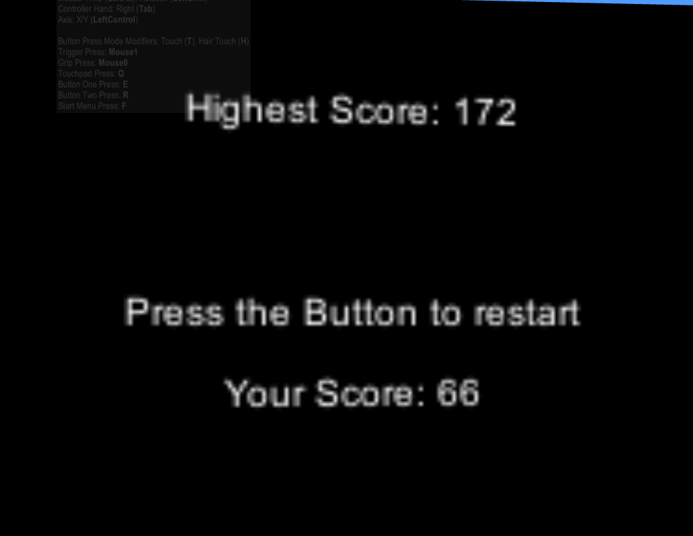
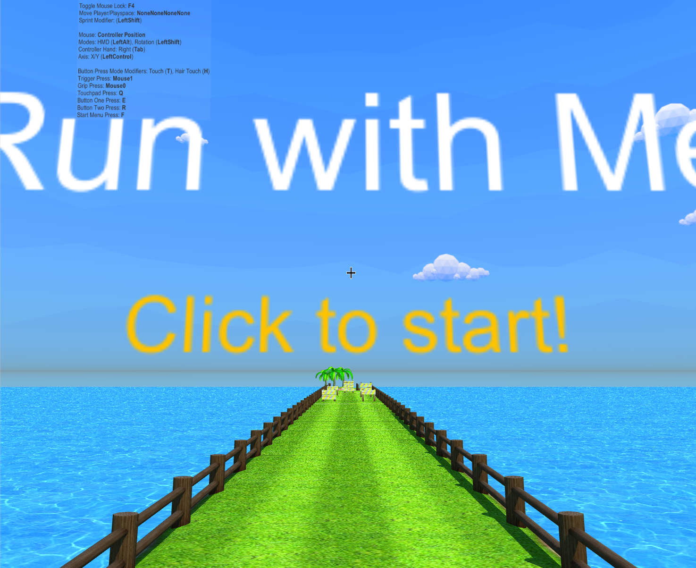
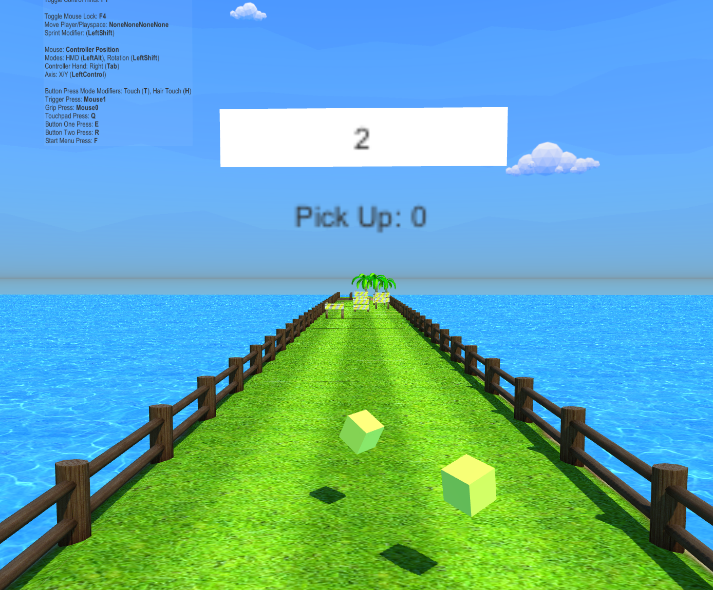

# 2019/3/26 上机练习进阶要求实现报告

516030910101 罗宇辰


------

## 1. 历史最高分的记录和展示



```C#
    //GameManager.cs
    //OnDeath

		score += 0.5f * pickupNum;
        float curMax = PlayerPrefs.GetFloat("score");
        if (score > curMax)	// 更新最高分
        {
            curMax = score;
            PlayerPrefs.SetFloat("score", curMax);
        }
     
        currentScore.SetActive(false);
        deathMenu.GetComponent<DeathMenu>().Show((int)score, (int)curMax);//显示最高分
```


## 2. 随游戏进程增加游戏难度

```C#
	//TileManager.cs
	//spawnRandomTile

		//// 随游戏进程增加hurdle的数量
        float time = Time.timeSinceLevelLoad;
        int num = Mathf.Max((int)time / 25, 5);
        spawnTile(index, num);
```


## 3. 添加游戏BGM和拾取PickUp音效


## 4. 实现游戏的初始界面

使用`StartMenu`来显示游戏标题，点击屏幕开始游戏




## 5.实现游戏场景中的PickUp收集和计数



```C#
//TileManager.cs

IEnumerator InitPickUp()
    {
        yield return new WaitForSeconds(0.5f);
        while (true)
        {
            int Cnt = Random.Range(2, 5);
            for (int i = 0; i < Cnt; i++)
            {
                ////不断在player前方生成PickUp
                Vector3 playerPos = playerTransform.position;
                Vector3 rockPosition = new Vector3(Random.Range(-1.2f, 1.2f), 1.0f, playerPos.z + 10.0f);
                Quaternion spawnRotation = Quaternion.identity;
                Instantiate(PickUp, rockPosition, spawnRotation);

                yield return new WaitForSeconds(0.5f);
            }
            yield return new WaitForSeconds(2.0f);

            if (GameManager.Instance.IsDead()) break;
        }
    }

```

```C#
//PlayController.cs

void OnTriggerEnter(Collider other) {
        if(other.CompareTag("CollisionWall") || other.CompareTag("FallWall"))
        {
            gameManager.OnDeath(true);
        }
        if(other.CompareTag("Pick Up"))
        {
            gameManager.addPickUp();//计数并显示
        }
    }
```

